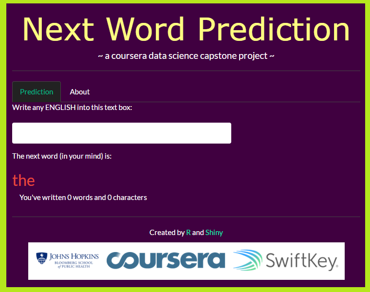

Cousera Capstone Project Presentation
========================================================
author: Nikhil Brahmankar
date: 25 March 2017

OBJECTIVES  

1. Build a shiny application to predict the next word.  
2. This exercise was divided into seven sub tasks like data cleansing, exploratory analysis, the creation of a predictive model and more.  
3. A corpus has been created from this [{Corpus Data Source}](https://d396qusza40orc.cloudfront.net/dsscapstone/dataset/Coursera-SwiftKey.zip).  
4.Multiple R packages (tm, slam, stringr, RWeka & parallel) have been used for text mining and [{NLP}](https://en.wikipedia.org/wiki/Natural_language_processing).  

APPLIED METHODS & MODELS
========================================================

- A corpus is generated by sampling a subset of the original data from the three sources (blogs,twitter and news) which is then merged into one.
- Corpus is then cleaned up by converting all words to lowercase, removing URL and special characters, eliminating numbers, punctuation, dashs and apostroples, and removing leading & trailing whitespaces.
- This sampled corpus was then used to create Bigram, Trigram, Quadgram and Quintgram [{See wikipedia *N-Grams*}](http://en.wikipedia.org/wiki/N-gram).
- Those aggregated bi-,tri-, quad- and quintgram term frequency matrices have been transferred into frequency dictionaries. Lastly, these n-gram dictionaries are saved as CSV files for future usage.

WORD PREDICTION MODEL
========================================================

- N-gram CSV files are first loaded.
- User input words are cleaned in the similar way as before prior to prediction of the next word.
- When an user input text, up to last N words will be used to predict the next word accroding to the frequencies of the underlying *N-Grams*. 
- For prediction of the next word, Quadgram is first used (first three words of Quadgram are the last three words of the user provided sentence).
- If no Quadgram is found, back off to Trigram (first two words of Trigram are the last two words of the sentence).
- If no Trigram is found, back off to Bigram (first word of Bigram is the last word of the sentence)
- If no Bigram is found, back off to the most common word with highest frequency 'the' is returned.
- Next word is then predicted using Stupid Backoff Algorithm with following formula:

$$Total_{prob} = 1*Quintgrams_{prob} + 0.4*Quadgrams_{prob} + 0.16*Trigrams_{prob} + 0.064*Bigrams_{prob}$$

HOW TO USE
========================================================

***

- Mobile users are targeted by this light weight application. 
- While entering the text, the predicted next word will be shown instantaneously.
- And how many words and characters the user just has entered will be displayed too.

NOTES
========================================================

- The next word prediction app is hosted on [shinyapps.io](https://nbrahman.shinyapps.io/capstoneproject/)

- The whole code of this application, as well as all the milestone report, related scripts, this presentation  etc. can be found in [this GitHub repo](https://github.com/nbrahman/Coursera/tree/master/Data%20Science/10.%20Capstone%20Project)

- This pitch deck is located [here](http://rpubs.com/brahmankarnikhil/jhudscpp)

- Following reference has been used
  - Nature Language Processing - Smoothing Models
  [{Bill MacCartney}](http://nlp.stanford.edu/~wcmac/papers/20050421-smoothing-tutorial.pdf)  
  - Nature Language Processing - About N-Gram
  [{Daniel Jurafsky & James H. Martin}](https://lagunita.stanford.edu/c4x/Engineering/CS-224N/asset/slp4.pdf)

- Learn more about the [Coursera Data Science Specialization](https://www.coursera.org/specializations/jhu-data-science)

