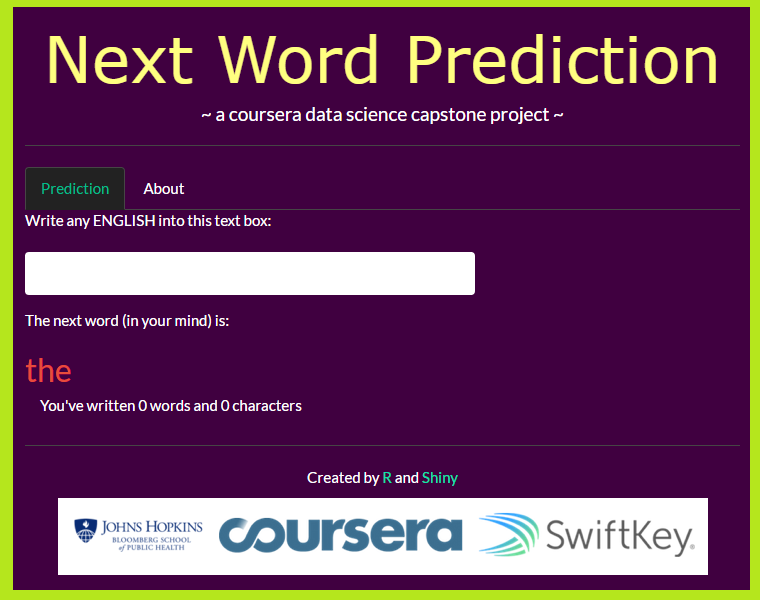

******

#### OBJECTIVES

* Build a shiny application that is able to predict the next word.  
* A corpus has been created from [(Corpus Data Source)](https://d396qusza40orc.cloudfront.net/dsscapstone/dataset/Coursera-SwiftKey.zip) for this project. 
* Multiple R packages (such as tm, slam, stringr, RWeka and parallel) have been used for text mining and natural language processing.

******

#### APPLIED METHODS AND MODELS

After a Corpus generated, then following clean up steps are performed.  
  
  * Convert all words to lowercase
  * Remove URL and special characters
  * Eliminate numbers, punctuation, dashs and apostroples
  * Strip whitespace, and Trim leading and trailing whitespace

This sampled corpus was then used to creat Bigram, Trigram, Quadgram and Quintgram [See wikipedia *N-Grams*](http://en.wikipedia.org/wiki/N-gram). 

When an user input text, up to last 4 words will be used to predict the next word accroding to the frequencies of the underlying *N-Grams*. 

Stupid Backoff Algorithm has been implemented as following formula:

Total_prob = 1*Quintgrams_prob + 0.4*Quadgrams_prob + 0.16*Trigrams_prob + 0.064*Bigrams_prob 

******

#### HOW TO USE

Mobile users are targeted by this light-weighted application. While entering the text, the predicted next word will be shown instantaneously. And how many words and characters the user just has entered will be displayed too (see screen shot below).

******

#### REFERENCE

* Nature Language Processing - Smoothing Models [Bill MacCartney](http://nlp.stanford.edu/~wcmac/papers/20050421-smoothing-tutorial.pdf)  
* Nature Language Processing - About N-Gram [Daniel Jurafsky & James H. Martin](https://lagunita.stanford.edu/c4x/Engineering/CS-224N/asset/slp4.pdf)

******

#### LINKS

* The scripts related to this shiny application, as well as the milestone report and the capstone project presentation (link) can be found in [this GitHub repository](https://github.com/nbrahman/Coursera/tree/master/Data%20Science/10.%20Capstone%20Project).
